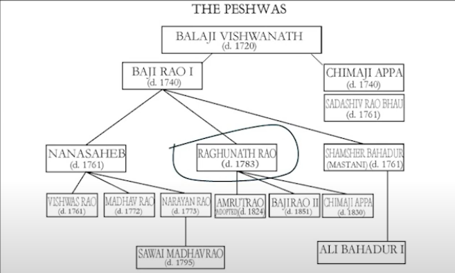

### शिवाजी महाराज
- जन्म (कार्यकाल): पुणे १६३० (~) ते १६८० 
- ध्येय: स्वराज्य
- मुद्रा: १६४६
  ```
  प्रतिपच्चन्द्रलेखेव वर्धिष्णुर्विश्ववन्दिता |
  साहसूनो: शिवस्यैषा मुद्रा भद्राय राजते ||
  ```
  - १६५६ - नौका आरमार निर्मिती
  - राज्याभिषेक - रायगड १६७४
  - त्यानंतर (१६७४) दक्षिण मोहीम प्रारंभ केली

 #### शिवोत्तर: संभाजी
 १६८० - १७०७ 

### पेशवे इस १७०० - १८१८

- छत्रपती शाहू (सातारा) (१६९० - १७१० ~ २० वर्षे कैदेत होता)
- १७१३ पर्यंत - मोरोपंत पिंगळे (शाहू म. चे पेशवे) हे कान्होजी आंग्रे (राणी ताराबाई चे सेनापती) ह्यांच्या कैदेत होते.
- ह्याच दरम्यान शाहू **बाळाजी विश्वनाथ** ह्यांची पेशवेपदी नेमणूक होते. त्याच वर्षी बा. विश्वनाथ मोरोपंतांना सोडवून आणतात.
- १७२० - बा. विश्वनाथ मृत्यु
- त्याच वर्षी **बाजीराव** (~ १९ वयवर्ष) ची पेशवेपदी नेमणूक होते. त्याला बरेच लोक विरोध करतात.

साभार: डॉ. उदय कुलकर्णी स्रोत: [youtube](https://www.youtube.com/watch?v=gHCwplqaqAM)



### पहिले बाजीराव 
जन्म: १७०० - १७४० (रावरखेड मध्यप्रदेश)
कार्यकाळ: १७२० - १७४० 
ध्येय: स्वराज्याचे साम्राज्य

<< २५:०० चलचित्र   >>

#### मराठे / **पेशवे** भारतातील विविध भागातील साम्राज्य कार्यकाळ

- **पंजाब** - १७५८-५९
- 
- **दिल्ली** - १७१९-३७ (प. बाजीराव होता)
-   १७५२-५५
-   १७५७-६१
-   १७७०-७३
-   १७८३-८८
-   १७८९-१८०३
-   त्यानंतर नियंत्रण ब्रिटिशांकडे गेलं
-   
-   **माळवा, बुंदेलखंड (मध्यप्रदेश)** - १७२९ - १८१८
-   
-   **गुजरात** - १७२०-१८१८

-   **महाराष्ट्र** - १६७४ - १८१८

-   **उ. कर्नाटक श्रीरंगपट्टणम पर्यंत** - १७४६ - १८१८

-   **तंजावर, तामिळनाडू येथील काही भाग** - १६७७-९८, १७४०-४३, १७५७-५९
-   
