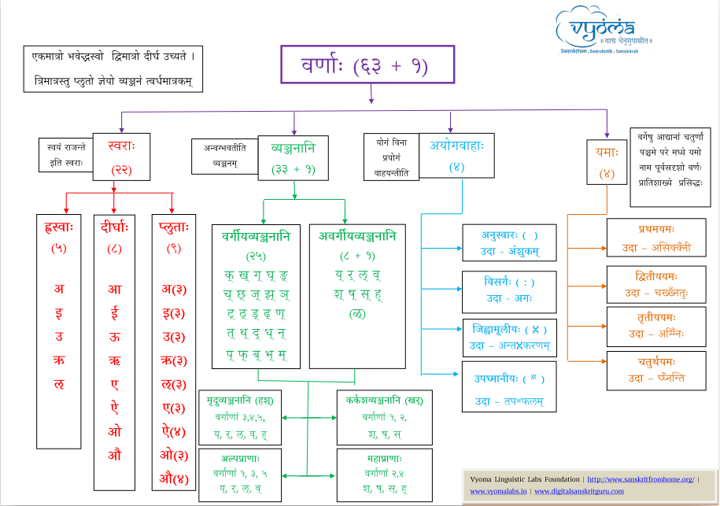

## वर्णा:

संस्कृते निम्नवर्णा: वर्तन्ते |



सौजन्य: व्योम-संस्कृत 


[फेबु: अष्टाध्यायीपरिचयः - Class 3 - वर्णज्ञानम् | Neelesh Bodas](https://www.youtube.com/watch?v=3Oe4TjeO-t8)

**वर्णानां द्वौ प्रकारौ**

**स्वरा:**
```
स्वयं राजन्ते इति
व्याकरणे अच्-वर्णा: इति नाम्ना ज्ञायन्ते
```

**व्यञ्जनानि** 
```
व्यज्यते इति (स्वरेण अनुगच्छति)
व्याकरणे हल्-वर्णा: इति नाम्ना ज्ञायन्ते

शब्देभ्य: एते प्रामुख्येण अर्थबोधका:
```

**अन्या: प्रमुखा: बिन्दव:**

- संस्कृते फ वर्णस्य उच्चार: ओष्ठौ किञ्चित् मिलित्वा करणीय:
- माहेश्वरसूत्रे वर्णानां य: क्रम: अस्ति, तस्य उपयोग: केवलं अष्टाध्यायीव्याकरणग्रन्थनिर्मित्या: कृते अस्ति


**अक्षरम्**
```
  - अन्यवर्णै: सह वा अन्यवर्णै: विना अथवा विद्यमान: स्वर: इति अक्षरम्
  - उदा: - अ
  - क ( क् + अ )
  - अम्
  - त्र ( त् + र् + अ )

```
