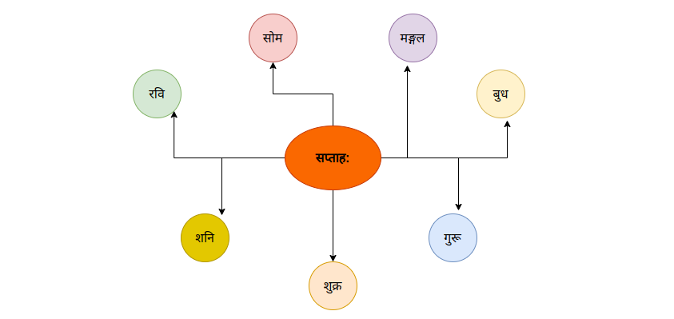
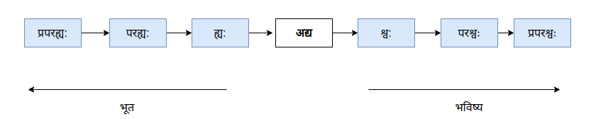
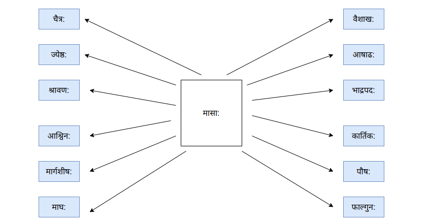

## काल: - वेळ - Time

**घटी, कालदर्शक: - घडयाळ - watch, clock**

**वार: वासर: - वार - Day**

**सप्ताह: , सप्तक: - आठवडा - Week**

**सप्ताहदिना: - आठवडयाचे दिवस - days in week**

<div id="days" class="tabular">रविवासर:, सोमवासर:, मङ्गलवासर:, बुधवासर:, गुरुवासर:, शुक्रवासर:, शनिवासर:</div>



**साप्ताहिक: (की, कम्)** - साप्ताहिक - weekly

<hr />

**दिननिर्देश:**



<div class="container">
  <div class="in-container">
  <p>प्रपरह्य:</p>
  <p>तेरवा</p>
  </div>

  <div class="in-container">
    <p>परह्य:</p>
    <p>काल</p>
    </div>

  <div class="in-container">
    <p>ह्य:</p>
    <p>काल</p>
  </div>

  <div class="in-container">
    <p>अद्य</p>
    <p>आज</p>
  </div>

  <div class="in-container">
    <p>श्व:</p>
    <p>उद्या</p>
    </div>
    
  <div class="in-container">
    <p>परश्व:</p>
    <p>परवा</p>
    </div>
    
  <div class="in-container">
    <p>प्रपरश्व:</p>
    <p>तेरवा</p>
    </div>
</div>

<hr />

**तिथि: (स्त्री), दिनाङ्क: - दिनांक - Date**

<div id="months" class="tabular">प्रतिपदा, द्वितीया, तृतीया, चतुर्थी, पञ्चमी, षष्ठी, सप्तमी, अष्टमी, नवमी, दशमी, एकादशी, द्वादशी, त्रयोदशी, चतुर्दशी</div>

चन्द्र-सूर्यपरस्परगतिम् अनुसृत्य निश्चिति: भवति ( तिथ्यारम्भ: प्रात: सार्धअष्टवादने अपि शक्यते) (सुर्योदय-सुर्यास्तौ अनुसृत्य न!!)

<hr />

**मास: - महिना - Month**

**कृष्णपक्ष: , शुक्लपक्ष:**

**Half Month, Fortnight - अर्धा महिना , पक्ष - अर्धमास: , पक्ष:**

**मासिक: (की, कम्)** - मासिक - monthly

**त्रैमासिक: ( की, कम् )** - त्रैमासिक - quarterly

**षड्मासिक: ( की, कम् ) , अर्धवर्षीय: (या, यम्)** - अर्धवर्षीय - half-yearly

<hr />

**द्वादश मासा:**

<div id="months" class="tabular">चैत्र:, वैशाख:, ज्येष्टः, आषाढ:, श्रावण:,भाद्रपद:, आश्विन:, कार्तिक:, मार्गशीर्ष:, पौष:, माघ:, फाल्गुन:</div>



<hr />

**षड् ऋतव: - ऋतु - seasons**

<div class="container">
  <div>वसन्त: चैत्र:, वैशाख:,</div>
  <div>ग्रीष्म: ज्येष्टः, आषाढ:</div>
  <div>वर्षा श्रावण:,भाद्रपद:</div>
  <div>शरद् आश्विन:, कार्तिक:</div>
  <div>हेमन्त: मार्गशीर्ष:, पौष:</div>
  <div>शिशिर: माघ:, फाल्गुन:</div>
</div>

<hr />

**दक्षिणायनम्, उत्तरायणम् - दक्षिणायन, उत्तरायण -**

<hr />

**वर्षम् , संवत्सर: - वर्ष - Year**

**वार्षिक: (की, कम्)** - वार्षिक - yearly

<hr />

**घण्टा (स्त्री) - तास - hour**

<hr />

**निमेष: - मिनिट - minute**

<hr />

**क्षण: , निमिष: - सेकंद - second**

<hr />

**प्रात: (अ) , प्रातम् (अ) , प्रातःकाल:** - सकाळ - morning

<hr />

**दिन: , दिवा (अ) - दिवस - Day**

<hr />

**मध्याह्न: , मध्याह्नकाल:** - दुपार - afternoon

<hr />

**सायम् (अ) , सायङ्काल: - संध्याकाळ - Evening**

<hr />

**रात्रि: , निशा , यामिनी - रात्र - Night**

<hr />

**चिरात् , चिरम्** - मोठा काळ - long time

<hr />

**इदानीम्** - आता - now

<hr />

**शनै:** - हळू - slow, slowly

<hr />

**शीघ्रम्, झटिति** - पटकन, लवकर - quickly

**तत्क्षणम् , समनन्तरम्** - लगेच, तातडीने - immediately

<hr />

**पूर्वम्** - आधी - before

पञ्चमीविभक्त्या: अपेक्षा

```
उदा.
- षड्वादनात् पूर्वम्
- मासात् पूर्वम्
- तत: पूर्वम्  (तत: = अव्ययम्)
```

<hr />

**परम् , पश्चात् , तदनन्तरम् , अनन्तरम्** - नंतर - after

पञ्चमीविभक्त्या: अपेक्षा

```
उदा.
- षड्वादनात् परम्
- मासात् परम्
- तत: परम्  (तत: = अव्ययम्)
```

<hr />

**पश्चात् , तदनन्तरम् , अनन्तरम्** - नंतर - later, afterwards

<hr />

**त: , आ** - पासून - from

पञ्चमीविभक्त्या: अपेक्षा

```
उदा.
- अद्यत: , अद्यारभ्य (अद्य + आरभ्य (अ))
- वर्षात्
- आबाल्यात्
```

<hr />

**पर्यन्तम्** - पर्यंत - till

```
उदा. (समासं कृत्वा)
- नववादनपर्यन्तम्
- अद्य यावत् (आजपर्यंत)
```

<hr />

**पूर्व , गत** - मागचा (-ची, -चे) - pre, back

```
उदा. (समासं कृत्वा)
- पूर्वतिथीय धनादेश:
- गतमास:
```

<hr />

**उत्तर, आगामि, अग्रिम** - आगामी , पुढचा (-ची, -चे) - future, post

```
उदा. (समासं कृत्वा)
- आगामितिथीय धनादेश:
- उत्तरमास:
- अग्रिमवर्षम्
```

<hr />

**सकृत् , एकवारम् , एकदा** - एकदा - once

<hr />

**वारम्** - वेळा - times

<hr />

**पूर्वकालिक: (की, कम् )** - पूर्वकालीन - before time

**उत्तरकालिक: (की, कम् )** - उत्तरकालीन - after time

**समकालिक: (की, कम् )** - समकालीन - same time

**सार्वकालिक: (की, कम् )** - सार्वकालीन - all time

**अकालिक: (की, कम् )** - अकाळी / अवकाळी - untimely
<hr />

**क: समय: - किती वाजले - what time**

सामान्यत: प्रथमाविभक्ति:

```
उदा.
- द्विवादनम्
- पादोन-पञ्चवादनम्
- एष: वसन्तऋतु:
```

**कदा - कधी (किती वाजता) - when**

काल निर्देशाय सप्तमीविभक्ति: प्रयोजनीया |

```
उदा.
- रात्रौ / रात्र्याम् , निशायाम्, सप्तवादने, एतस्मिन् वर्षे , मार्चमासे इ.
- एकघण्टाया: परम् ( अव्यय अत: पञ्चमीविभक्ति:)
```


### विशेषांशः

https://www.facebook.com/share/N9rjngENo5M12i57/

- भारतीय-कालगणना चन्द्रसुर्याधारिता (उभौ) अस्ति
- वसन्त-संपात (Vernal equinox) - सामान्यत: २०/२१ मार्च
- शरद-संपात (Autumnal equinox) - सामान्यत: २३ सप्टेंबर
- उत्तरायण (winter solstice ) - सामान्यत: २१ २२ डिसे.
- दक्षिणायन (summer solstice) - सामान्यत: २१ जुन
