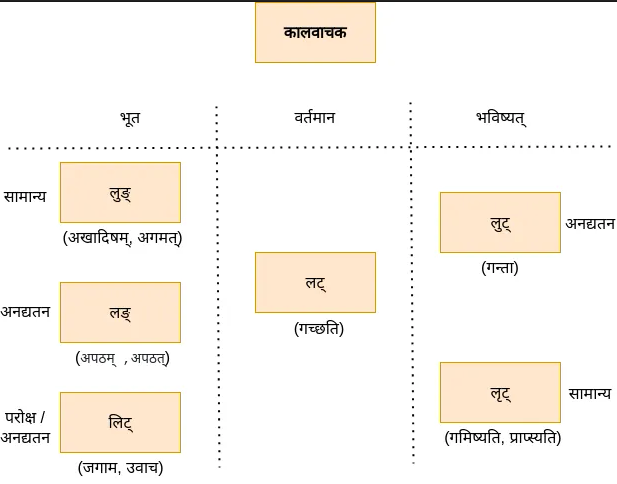

## क्रियापदम् ( तिङ्न्त:)

स्रोत: नीलेशबोडस: [दशलकाराः संस्कृत व्याकरणपरिचयः](https://www.youtube.com/watch?v=Aad0AWA37e8)

**धातु: + तिङ्-प्रत्यय: = क्रियापदम्**
- प्राय: २००० धातव:
- विभागौ - परस्मैपदि , आत्मनेपदि वा उभयपदि


### लकारा:

[द्वितीय भाग: भाववाचका: (भाव-निर्देशार्थम्)](./?t=verb-bhav)

#### कालवाचका: (काल-निर्देशार्थम्)

- वर्तमान - लट्
- भूत - लिट् , लुङ् (द्वौ पुराकाले प्रामुख्येन) , लङ् (लौकिकाले प्रामुख्येन)
- भविष्यत् - लुट् , लृट्
- लेट्




### वर्तमान - लट्-लकार:

प्रत्यया:

**परस्मैपदी (पप.)**

- ति त: अन्ति
- सि थ: थ
- मि व: म: 

**आत्मनेपदी (आप.)**

- ते  इते  अन्ते
- से  इथे  ध्वे
- ए  वहे  महे

```
आप. - सीता अयोध्यायां रमते
पप. - अहं संस्कृतं पठामि
```

### भविष्यत्

**लृट्-लकार: सामान्य-भविष्यत् कालम् निदर्शयति**

प्रत्यया:

पप.
- स्यति स्यतः स्यन्ति
- स्यसि स्यथ: स्यथ
- स्यामि स्याव: स्यामः

आप.
- स्यते स्येते स्यन्ते
- स्यसे स्येथे स्यध्वे
- स्ये स्यावहे स्यामहे

```
अहं अयोध्यां गमिष्यामि
राम: रावणवधं करिष्यति 
```

**लुट्-लकार: (ता - भविष्यत्काल:) अनद्यतन (अद्यतनदिनात् परम् सर्वक्रिया: (श्वस्तन, अग्रिमसप्ताहे, मासे इत्यादि)) -भविष्यत् कालम् निदर्शयति**

व्याकरणनियमान् अनुसृत्य यदा अद्यतन क्रिया न अस्ति तदा तस्या: निर्देशार्थं केवलं लुट्-लकार: एव योजनीय: किन्तु लौकिकसंस्कृते अस्य उपयोग: नगण्य:| 
```
लुट् - राम: श्व: वनं गन्ता
लृट् - राम: श्व: वनं गमिष्यति वा राम: अग्रिमे सप्ताहे अयोध्यां गमिष्यति
```

### भूत

**लङ्-लकार:**

अनद्यतन भूतकालम् निदर्शयति

```
अहं ह्य: अपठं
XX असाधु - अहं अद्य एव आगच्छं - (व्याकरणनियमान् अनुसृत्य इदं वाक्यं दोषपुर्णं यत: अत्र अद्यतन आगमन-क्रियानिर्देश: अस्ति)
साधु - अहं अद्य एव आगमम् - ( अत्र आगमम् इति लङ्-लकारस्य रूपं योजितम् )
```

प्रत्यया:

पप.
- त् ताम् अन्
- स् तम् त
- अम् व म

आप.
- त इताम् अन्त
- था: इथाम् ध्वम्
- इ वहि महि


**लुङ्-लकार:**

सामान्य-भुतकालम् निदर्शयति | लौकिकसंस्कृते अस्य उपयोग: नगण्य:|

```
प्रात: अहं अखादिषम्
गतमासे राम: अगमत्
```

**लिट्-लकार:**

परोक्ष, अनद्यतन-भूतकालम् निदर्शयति| परोक्ष नाम अक्ष्ण: पर: , या क्रिया अस्माकं नेत्रयो: अग्रे न (अक्ष्ण: पर:) भवति तासां निर्देशार्थं अयं लकार: योजनीय:| **एष: लकार: केवलम् अतिप्राचीनघटनानिर्देशाय न भवति ( यथा कानिचन पुस्तकानि निदर्शयन्ति ) |**

यत्र कर्ता स्वस्य ज्ञानं विना एव (सुप्तावस्थायाम् / संमोहन-अवस्थायाम् /मादकद्रव्यसेवनानन्तरं वा) किञ्चित् कार्यम् करोति, तत्र अनन्तरम् तस्य कार्यस्य निर्देशं कर्तुम् कर्ता लिट्-लकारस्य प्रयोगः कर्तुम् अर्हति |

लौकिकसंस्कृते अस्य उपयोग: नगण्य:|

```
राम: वनं जगाम
मोदीप्रधानमन्त्री आज्ञापयामास
स्वप्ने अहम् उवाच
```

